# Laboratorio de Comunicaciones
## Universidad Industrial de Santander

# Práctica 1: TÍTULO PRÁCTICA

### Integrantes
- **Maria Fernanda Guerrero Santos** - 2202343
- **Michelle Garzón Campos** - 2202785

Escuela de Ingenierías Eléctrica, Electrónica y de Telecomunicaciones  
Universidad Industrial de Santander

### Fecha
25 de Febrero 2025

---

## Declaración de Originalidad y Responsabilidad
Los autores de este informe certifican que el contenido aquí presentado es original y ha sido elaborado de manera independiente. Se han utilizado fuentes externas únicamente como referencia y han sido debidamente citadas.

Asimismo, los autores asumen plena responsabilidad por la información contenida en este documento. 

Uso de IA: Se utilizó ChatGPT para reformular secciones del texto y verificar gramática, pero el contenido técnico fue desarrollado íntegramente por los autores.

---
## Contenido

### Resumen
En esta práctica, en la primera parte se hizo una introducción con el programa GNU radio, en la cual se generaron diferentes señales donde se variaron sus características principales, como offset, frecuencia y amplitud. Esta práctica logró un primer acercamiento con el comportamiento de las señales y cómo modificarlas según sea necesario. En su segunda parte, se hizo un reconocimiento de los equipos, como el osciloscopio, el SDR y el analizador de espectros, donde se logró tener un primer acercamiento al comportamiento de estos instrumentos y la forma de medir con los mismos ciertos parámetros como la ganancia. Para la tercera parte, se usan nuevos equipos, se revisa su configuración y especificaciones técnicas para trabajarlos con señales generadas en GNU radio, para lograr un análisis del comportamiento de las ondas en tiempo y frecuencia. Además, se hace un primer acercamiento al trabajo con las ondas de radio FM y sus comportamientos. Finalmente, se usa el USRP 2920 para transmitir señales y medir algunos datos como ancho de banda y potencia.  

### Introducción
El laboratorio de comunicaciones requiere conocimientos en diferentes programas e instrumentos, si se quiere tener un correcto uso y medición de las condiciones de las señales de entrada y salida. Esta primera práctica tiene como objetivo hacer una primera introducción a los principales instrumentos y software requeridos en el futuro desarrollo de las demás prácticas. Se dividió en tres partes: en la primera, se hizo un reconocimiento del software GNU radio, que permite controlar las señales generadas. En la segunda parte, se hicieron unas primeras mediciones con la ayuda del osciloscopio, el analizador de espectros y el SDR. En la última parte, se hizo una revisión de las especificaciones técnicas de los diferentes instrumentos, y se usó el USRP 2920 para transmitir señales. Todo esto permite un mayor conocimiento sobre el funcionamiento de los diferentes implementos y la práctica de las mediciones en condiciones más cercanas a las reales.


### Procedimiento
#### Primera parte
En la primera parte, se hizo una práctica con GNU radio, donde se generaron bloques de señales fuente, cuyos parámetros son controlados por variables generadas por el mismo usuario, además de realizar diferentes interconexiones que alteran su comportamiento. Se compiló el código y se guardó como evidencia.
Después, se generó una señal senoidal con ciertas condiciones de frecuencia, la cual se representa en tiempo y frecuencia de la siguiente manera.

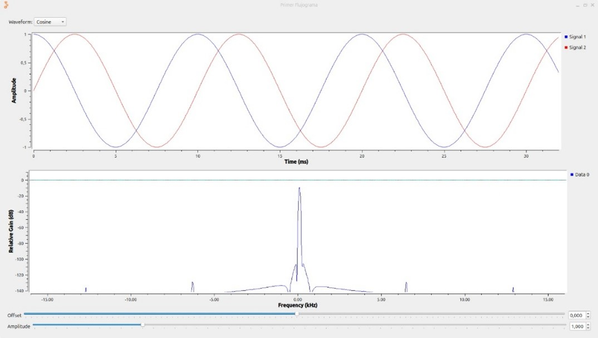

Luego se cambió la forma de la señal a una triangular, su frecuencia y la forma de los datos a una salida real, lo cual nos da como resultado la siguiente figura:

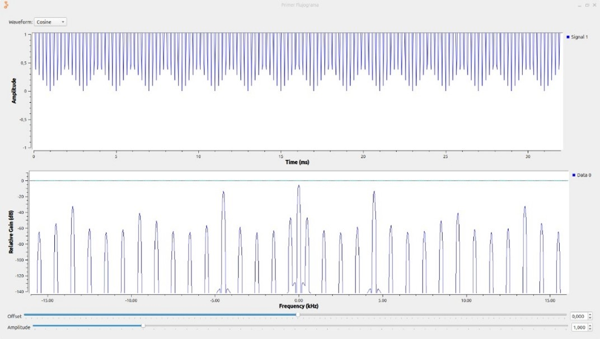

Para evaluar el teorema de Nyquist, se hicieron las comparaciones con diferentes relaciones de muestreo. En primer lugar, con el límite del teorema de Nyquist, n=2:

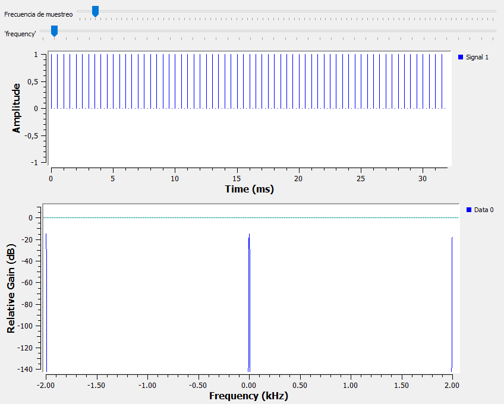

Luego se hizo la prueba con relación de muestreo n=5, lo cual nos da como resultado el siguiente comportamiento:

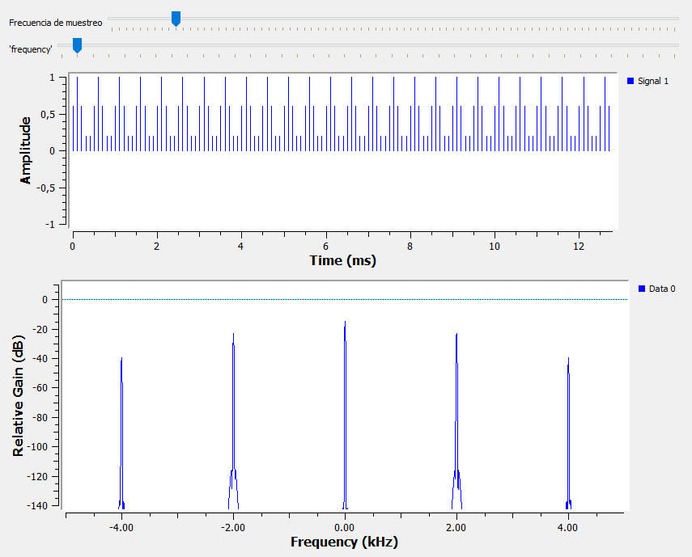

Además, se hizo la medición con una cantidad 10 veces superior de relaciones de muestreo (n=20) 

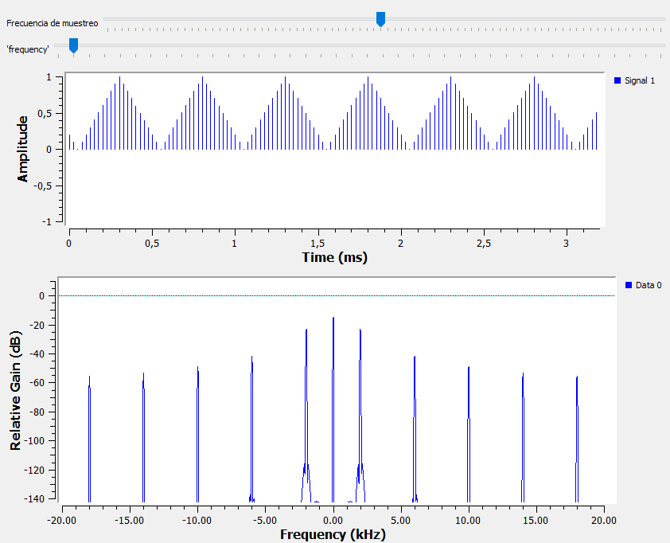

Para verificar el impacto, se hizo el experimento de trabajar con un número de relaciones de muestreo que no fuera entero, en este caso 13.333

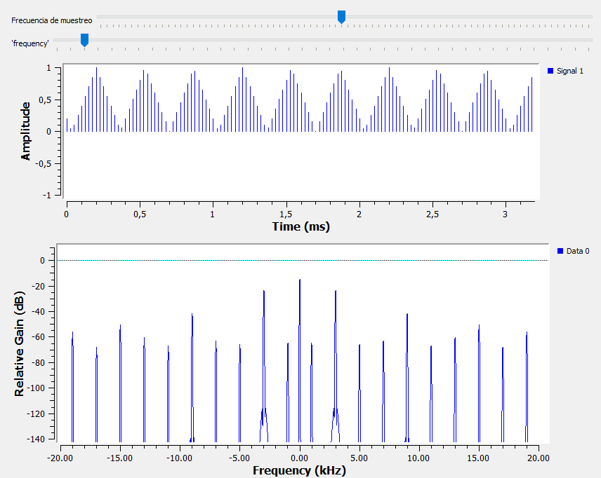

#### Segunda parte

En la segunda práctica, además del programa usado anteriormente, se hizo la conexión del generador de señales SDR con el osciloscopio, con el objetivo de medir la relación entre la amplitud generada y la medida por el osciloscopio, lo cual dio los siguientes resultados, con una frecuencia de 200 MHz y una GTX de 30


### 1B
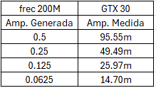 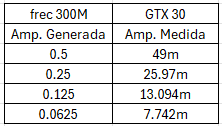 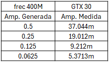

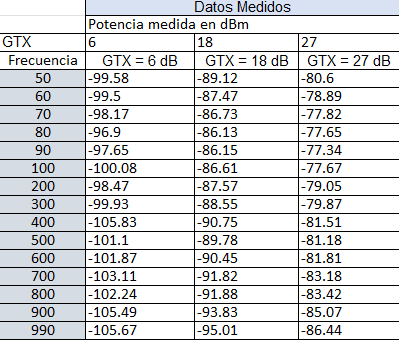 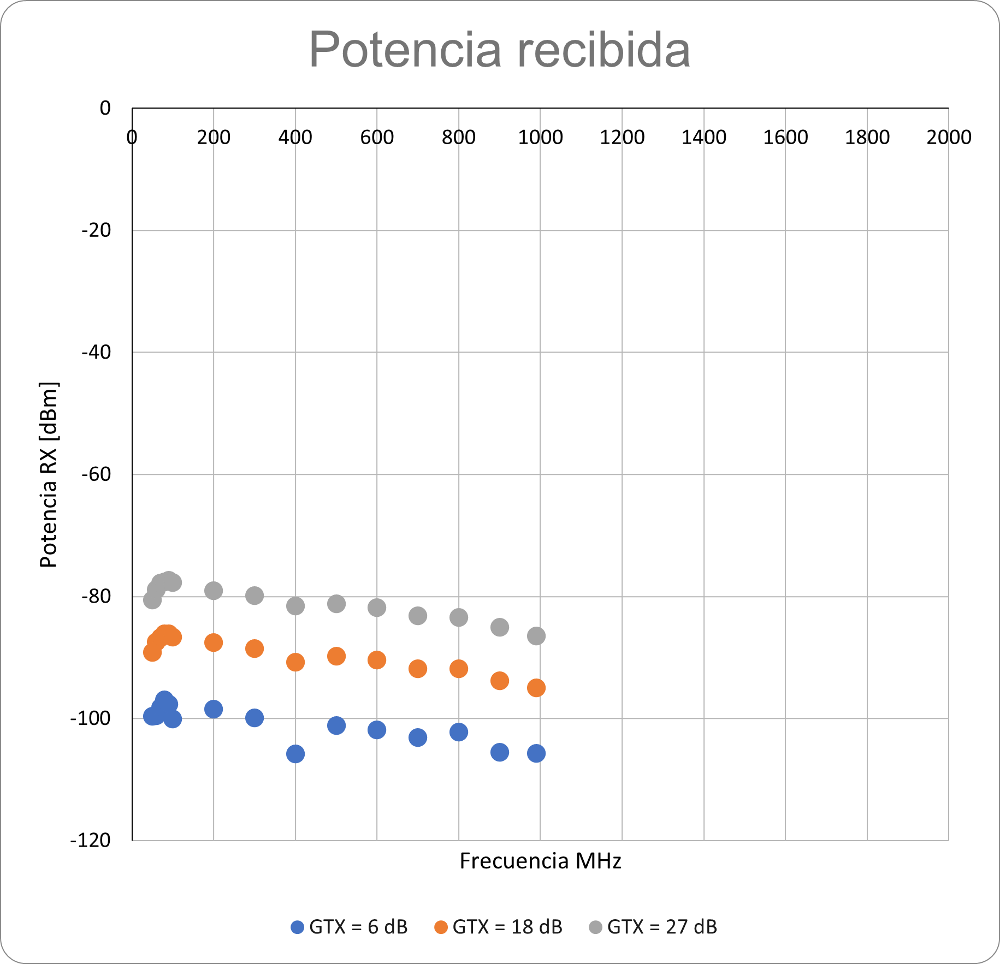

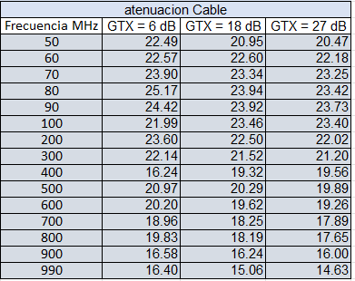 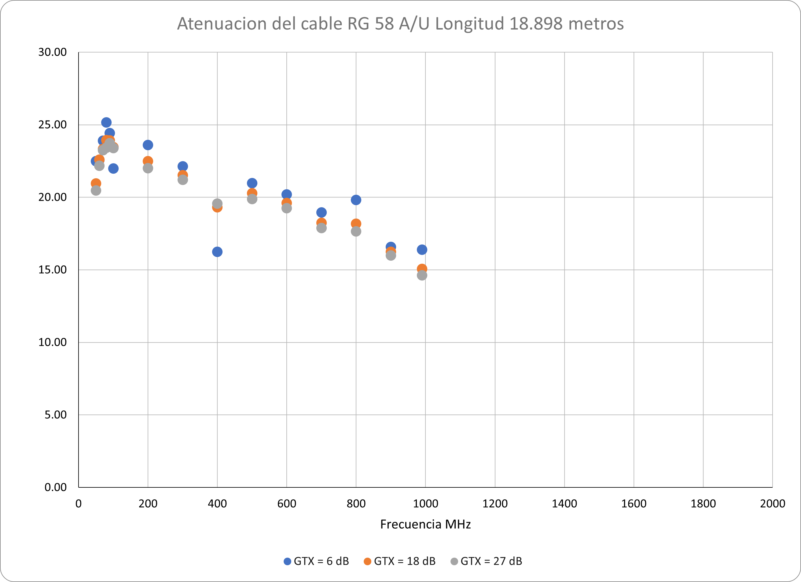

### 1C


### Conclusiones
-	El software GNU radio permite controlar el comportamiento de las señales de entrada, además de la ganancia que se generará.
-	Los instrumentos de medición están sometidos a diferentes condiciones que pueden afectar su exactitud, como la frecuencia en la que están trabajando o la relación señal/ruido que se presenta en la entrada. Es necesario tener esto en cuenta al momento de trabajar con los mismos.
-	Se pueden usar diferentes equipos para medir algunos parámetros importantes de las señales. El equipo que se elige depende de qué comportamiento se espera de la señal y del criterio específico que sea requerido.
-	La forma de trabajar los datos y las aproximaciones en las mediciones es un factor significativo de la calidad y la exactitud de las señales analizadas 

### Referencias
Ejemplo de referencia:

- [Proakis, 2014] J. Proakis, M. Salehi. Fundamentals of communication systems. 2 ed. England: Pearson Education Limited, 2014. p. 164-165, 346. Chapter 5 In: [Biblioteca UIS](https://uis.primo.exlibrisgroup.com/permalink/57UIDS_INST/63p0of/cdi_askewsholts_vlebooks_9781292015699)

---
# Ejemplos usando Markdown

Volver al [INICIO](#laboratorio-de-comunicaciones)

## Inclusión de Imágenes
### Imagen de referencia dentro del repositorio:


### Imagen de fuente externa


### Uso de html para cambiar escala de la imagen


## Creación de hipevínculos 
- [Aprende Markdown](https://markdown.es/)
- [Más acerca de Markdown](https://docs.github.com/en/get-started/writing-on-github/getting-started-with-writing-and-formatting-on-github/basic-writing-and-formatting-syntax)
- [Abrir documento en el repositorio](my%20file/test_file.txt). Si hay espacios en la ruta de su archivo, reemplácelos por `%20`.
- Ir a una sección de este documento. Por ejemplo: [Ir a Contenido](#contenido) Tenga en cuenta escribir el título de la sección en minúsculas y los espacios reemplazarlos por guiones.
## Uso de Expresiones Matemáticas
Se pueden incluir ecuaciones en el archivo `README.md` utilizando sintaxis similar a [LaTeX](https://manualdelatex.com/tutoriales/ecuaciones):

### Ecuaciones en Línea
```
La energía de una señal exponencial es $E = \int_0^\infty A^2 e^{-2t/\tau} dt$.
```
**Salida renderizada:**
La energía de una señal exponencial es $E = \int_0^\infty A^2 e^{-2t/\tau} dt$.

### Ecuaciones en Bloque
```
$$E = \int_0^\infty A^2 e^{-2t/\tau} dt = \frac{A^2 \tau}{2}$$
```
**Salida renderizada**
$$E = \int_0^\infty A^2 e^{-2t/\tau} dt = \frac{A^2 \tau}{2}$$

## Creación de Tablas

**Tabla 1.** Ejemplo de tabla en Markdown.

| Parámetro | Valor |
|-----------|-------|
| Frecuencia (Hz) | 1000 |
| Amplitud (V) | 5 |
| Ciclo útil (%) | 50 |

## Inclusión de código

```python
def hello_world():
    print("Hello, World!")
```

También es posible resaltar texto tipo código como `print("Hello, World!")`.

---

Volver al [INICIO](#laboratorio-de-comunicaciones)
