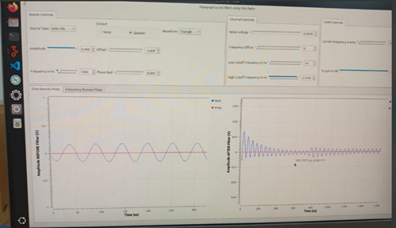

# Laboratorio de Comunicaciones
## Universidad Industrial de Santander

# Práctica 2A. Modelo de canal

### Integrantes
- **Maria Fernanda Guerrero Santos** - 2202343
- **Michelle Garzón Campos** - 2202785

Escuela de Ingenierías Eléctrica, Electrónica y de Telecomunicaciones  
Universidad Industrial de Santander

### Fecha

---

## Declaración de Originalidad y Responsabilidad
Los autores de este informe certifican que el contenido aquí presentado es original y ha sido elaborado de manera independiente. Se han utilizado fuentes externas únicamente como referencia y han sido debidamente citadas.

Asimismo, los autores asumen plena responsabilidad por la información contenida en este documento. 

Uso de IA: Se utilizó ChatGPT para reformular secciones del texto y verificar gramática, pero el contenido técnico fue desarrollado íntegramente por los autores.

## RESUMEN
En esta práctica se desarrolló la simulación y puesta en práctica del canal y los diferentes fenómenos que lo afectan. Se dividió en cuatro partes: la simulación del canal a través de GNU radio, el análisis de los fenómenos del canal en el osciloscopio y en el analizador de espectros, y los efectos de los fenómenos del canal en la conversión de frecuencia. A través del uso del simulador GNU radio se pudo observar a través de los instrumentos de medición el comportamiento que presentaban las diferentes señales, y se concluyó de forma principal que al aplicar filtros se puede recuperar el mensaje de una señal, a pesar de la presencia de ruido.

## INTRODUCCIÓN 
Uno de los elementos más importantes en el proceso de las comunicaciones es el canal, debido a que es el medio por el cual se transmite el mensaje que se espera que llegue al receptor desde el emisor. Conocer las diferentes condiciones que pueden afectarlo es entonces fundamental para las comunicaciones. 
El ruido que se genera al transmitir la señal a través del canal es prácticamente inevitable. Sin embargo, existen herramientas como los filtros de frecuencia que pueden permitir que el mensaje llegue con la menor cantidad de interferencia posible. La forma de aplicar estos filtros y como permiten recuperar la señal serán analizados en este informe, además de cómo se ve la señal del mensaje en los diferentes instrumentos de medición. 
Se concluye de forma principal que el canal, aunque pueda presentar ciertas distorsiones al momento de transmitir la señal, esta puede ser recuperada a través de la aplicación de filtros, pasabaja y/o pasabanda, que permitan pasar la frecuencia del mensaje y disminuir el impacto de las demás interferencias.

## PROCEDIMIENTO
### Actividad 1: Actividades de simulación de canal en GNU Radio
En primer lugar, se cargó el flowgraph propuesto para la práctica, el cual fue utilizado para hacer las simulaciones de la práctica. Se analizó la respuesta para diferentes tipos de señales, especialmente la del archivo .wav, la cual se da como se ve en la imagen: 

 
Figura 1. Respuesta en el tiempo para el archivo .wav

Una vez hecho esto, se aplicaron los diferentes filtros requeridos (pasabaja y pasa alta), y con la señal en condiciones ideales no se observo un cambio siempre y cuando permitieran pasar la frecuencia del mensaje. Esto cambia una vez se añade ruido, ya que a través de estos filtros se permite que se pueda recuperar el mensaje de la señal si los filtros aplicados permiten pasar sólo la frecuencia del mensaje. Esto se puede ver de forma más clara en la siguiente imagen:

 
Figura 2. Respuesta de la señal en el tiempo, teniendo ruido

Como se puede ver, a pesar de que la señal tenga ruido, el mensaje puede ser recuperado al aplicar filtros, aunque tenga una amplitud considerablemente más baja que el mensaje original.

---

### Actividad 2: Fenómenos de canal en el osciloscopio
Para la segunda parte, se transmitieron diferentes señales generadas a través de GNU radio y se analizó el comportamiento de estas. En primer lugar, para la señal .wav, al añadir el filtro de pasa alta y pasa bajas, y un ruido de voltaje de 0.03, que se ve en el simulador como se ve en la imagen:

 
Figura 3. Señal generada para el osciloscopio con archivo .wav, ruido de 0.03 y filtros

Se observó un comportamiento de esta forma en el osciloscopio:

 
Figura 4. Respuesta en el osciloscopio para el archivo .wav, con ruido de 0.03 y filtros

Y para el segundo, que era una señal seno donde se presentaba un ruido de  voltaje de 0.03 y unos filtros de pasa baja y pasa alta para que sólo pasara las frecuencias muy cercanas al mensaje, con un comportamiento esperado de la siguiente forma:

 
Figura 5. Comportamiento esperado de la señal seno, con ruido de 0.03 y filtros

Se obtuvo un resultado en el osciloscopio de la siguiente manera:

 
Figura 6. Resultado para la señal seno en el osciloscopio, con ruido de 0.03 y filtros

- Usando cables coaxiales de diferentes longitudes, ¿cómo afecta la distancia entre el transmisor y el receptor a la amplitud de la señal medida?

  El largo del cable se generan atenuaciones y da paso a ruido.

Figura 7. Señal con cable coaxial corto

Figura 8. Señal con cable coaxial largo

- Usando antenas, ¿cómo afecta la distancia entre el transmisor y el receptor a la amplitud de la señal medida? ¿Es posible compensar el fenómeno?

  La distancia entre las antenas afecta directamente la amplitud de la señal, esto se demosytró en el laboratorio de manera un poco obvia ya que practicamente la distancia entre las antenas tuvo que ser nula para poder visualizar la señal.

Figura 9. Señal transmitida con antena

- ¿Qué modelo de canal básico describe mejor las mediciones obtenidas en la práctica?

  El modelo de perdida por espacio libre FRIIS, el cual describe la pérdida de señal en un enlace inalámbrico en espacio libre, relacionando la potencia recibida con la transmitida, las ganancias de las antenas, la distancia y la longitud de onda.
  
---

## Actividad 3: Fenómenos de canal en el analizador de espectro

- ¿Cuál es el efecto del ruido sobre la respuesta en frecuencia de las señales medidas en el analizador de espectro? ¿Conservan las mismas relaciones que se evidencian en la simulación?

El ruido ensucia la señal, hace que el espectro se vea más ancho o borroso, y a veces tapa detalles importantes. En la simulación se ve todo más limpio, pero en la vida real el ruido cambia bastante la forma de la señal.

- ¿La relación señal a ruido creada intencionalmente desde el computador se amplifica o se reduce en la señal observada en el analizador de espectro?

Generalmente se reduce, porque en la transmisión real se suma más ruido del entorno y del equipo. No es tan ideal como en la simulación.

- ¿Cómo se evidencia el fenómeno de desviación de frecuencia en el analizador de espectro? Evidenciar al menos con dos formas de onda.

Se nota porque la señal se mueve de su frecuencia central. Si comparas dos formas de onda (como una señal sin modulación de frecuencia y otra con FM), en la FM verás que su espectro ocupa más ancho de banda o parece como “expandida”.

- Determine la afectación de un medio de transmisión coaxial (usar cables largos) sobre una señal periódica operando a las capacidades máximas de muestreo del USRP.
  
El cable largo debilita la señal y puede distorsionarla si la frecuencia es muy alta. También puede aparecer más ruido o ecos si el cable no está bien adaptado.
  
- Usando cables coaxiales de diferentes longitudes, ¿cómo afecta la distancia entre el transmisor y el receptor a la amplitud de la señal medida?

A mayor distancia, menor amplitud. El cable atenúa la señal, especialmente si es largo o de baja calidad.
  
- Usando antenas, ¿cómo afecta la distancia entre el transmisor y el receptor a la amplitud de la señal medida? ¿Es posible compensar el fenómeno?

Con antenas, al alejar el transmisor y el receptor, la señal se debilita bastante. Sí se puede compensar usando antenas mejores, amplificadores o ajustando la ganancia del sistema.
  
---

## Actividad 4: Efectos de los fenómenos de canal en la conversión de frecuencia

- ¿Cómo se evidencian los diferentes fenómenos de canal en la señal recibida?
  -La señal se ve más débil.
  -Se llena de "ruido" o interferencia.
  -A veces la señal se distorsiona o se corta.
  -Puede llegar con ecos o desfase.
  -En movimiento, la frecuencia puede cambiar un poco.
  
- ¿Cómo se pueden mitigar los efectos del canal en la señal recibida?
  -Subir la potencia.
  -Usar mejores antenas.
  -Acercar los equipos.
  -Evitar obstáculos.
  -Usar filtros y corrección de errores.
