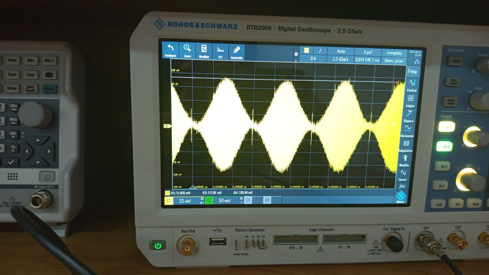
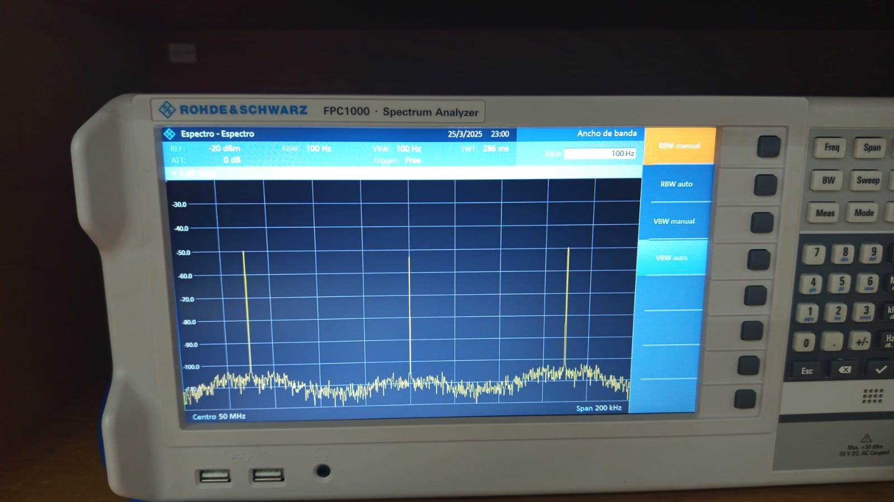
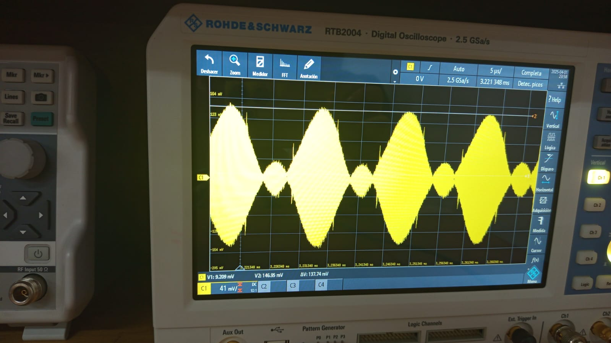
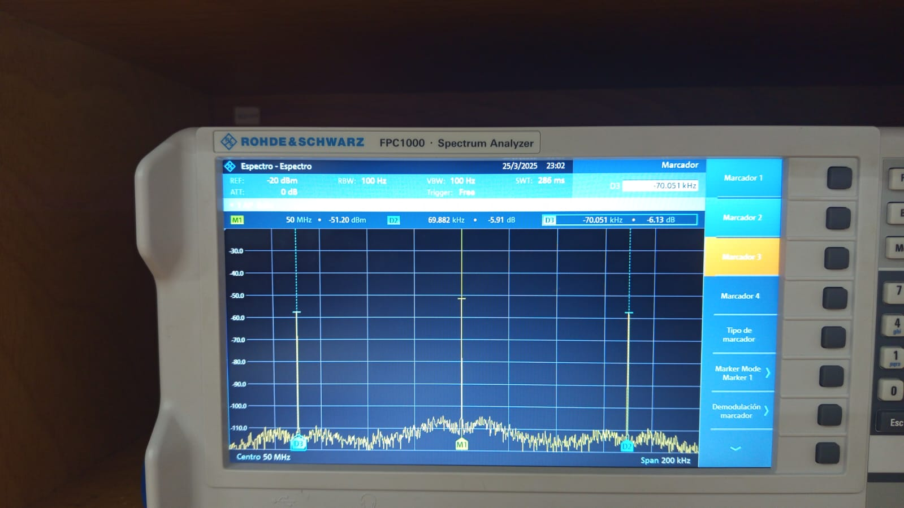
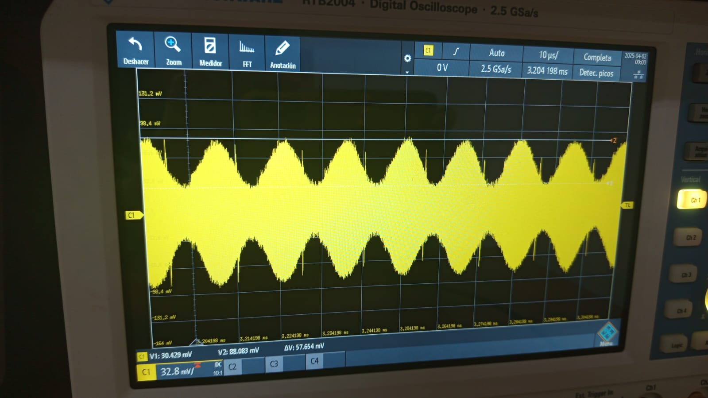
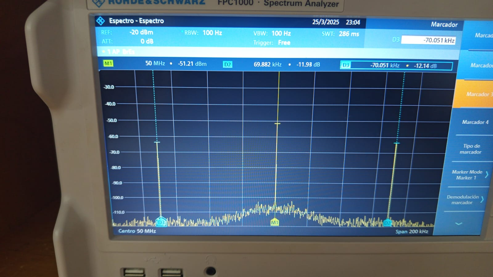

# Laboratorio de Comunicaciones
## Universidad Industrial de Santander

# Práctica 3. Modulaciones lineales

### Integrantes
- **Maria Fernanda Guerrero Santos** - 2202343
- **Michelle Garzón Campos** - 2202785

Escuela de Ingenierías Eléctrica, Electrónica y de Telecomunicaciones  
Universidad Industrial de Santander

### Fecha

---

## Declaración de Originalidad y Responsabilidad
Los autores de este informe certifican que el contenido aquí presentado es original y ha sido elaborado de manera independiente. Se han utilizado fuentes externas únicamente como referencia y han sido debidamente citadas.

Asimismo, los autores asumen plena responsabilidad por la información contenida en este documento. 

Uso de IA: Se utilizó ChatGPT para reformular secciones del texto y verificar gramática, pero el contenido técnico fue desarrollado íntegramente por los autores.

# Resumen
Para la primera parte de esta práctica se construyó un modelo para la envolvente compleja de modulaciones lineales, además de generar un diagrama modulador AM y analizar sus respuestas en el tiempo y la frecuencia para diferentes señales, teniendo en cuenta los diferentes casos de ka*Am, y la potencia presentada para cada uno de estos. En la segunda parte de la práctica, se generó una fuente aleatoria binaria para comparar el porcentaje de modulación de la señal y repetir el proceso con una señal de audio. Se concluye principalmente que, dependiendo del índice de modulación va a variar la respuesta de esta, y que el valor ideal es 1 para que la señal sea modulada de la forma adecuada. Esto se cumple sin importar la forma de la señal de entrada. 
# Introducción
El proceso de modulación de una señal para su transmisión es una de las bases que permite la comunicación como la conocemos en la actualidad. Permite transmitir, a través de señales digitales o eléctricas, la información del emisor a través del canal. Las modulaciones lineales, en este caso específico la modulación AM, dan lugar a transmitir diferentes formas de señales sin que se pierda el mensaje.
Esto se pudo comprobar a través de la práctica, donde se trabajaron diferentes formas de señales (incluyendo algunas similares a las que se trabajarían en un caso real), en las cuales se midieron diferentes parámetros, como la potencia de la señal, la respuesta en el osciloscopio y en el analizador de espectros, comparándolas entre sí dependiendo del valor de ka*Am.
Con estos resultados, puede decirse que, sin importar la forma de la señal, aquella que da una respuesta en el osciloscopio más cercana a la forma original de la misma es la señal donde se mantiene un ka*Am=1, es decir, una modulación del 100%. Valores superiores de este parámetro nos dan señales “fantasma” (falsos picos en el osciloscopio), y valores inferiores tienen unas respuestas similares, pero no iguales, a la señal original.
Respecto a la respuesta en frecuencia, pueden observarse la envolvente y las dos bandas laterales para las dos señales medidas en la primera parte, y se estimó el ancho de banda para las señales de la segunda.
# PROCEDIMIENTO
## Primera parte
Utilizando el código suministrado en GNU radio, se genera el bloque de modulador AM, y se realiza la en el osciloscopio y el analizador de espectro de la señal cos(t) para los diferentes casos de ka*Am.  Para el primer caso, con ka*Am=1, se obtiene la siguiente respuesta:

 
Figura 1. Respuesta en el osciloscopio para señal coseno con ka*Am=1.

 
Figura 2. Respuesta en el analizador de espectro para señal coseno con ka*Am=1.

Para el caso sobremodulado, con un ka*Am=1.5, se obtiene la siguiente respuesta.

 
Figura 3. Respuesta en el osciloscopio para señal coseno con ka*Am=1.5

 
Figura 4. Respuesta en el analizador de espectro para señal coseno con ka*Am=1.5

Finalmente, para un índice menor a 1, se obtiene la siguiente respuesta

 
Figura 5. Respuesta en el osciloscopio para la señal coseno con ka*Am=0.5

 
Figura 6. Respuesta en el analizador de espectro para la señal coseno con ka*Am=0.5

En todos los casos se pudo observar que las señales observadas en el osciloscopio concuerdan con la modulación a la que se queria llegar.
